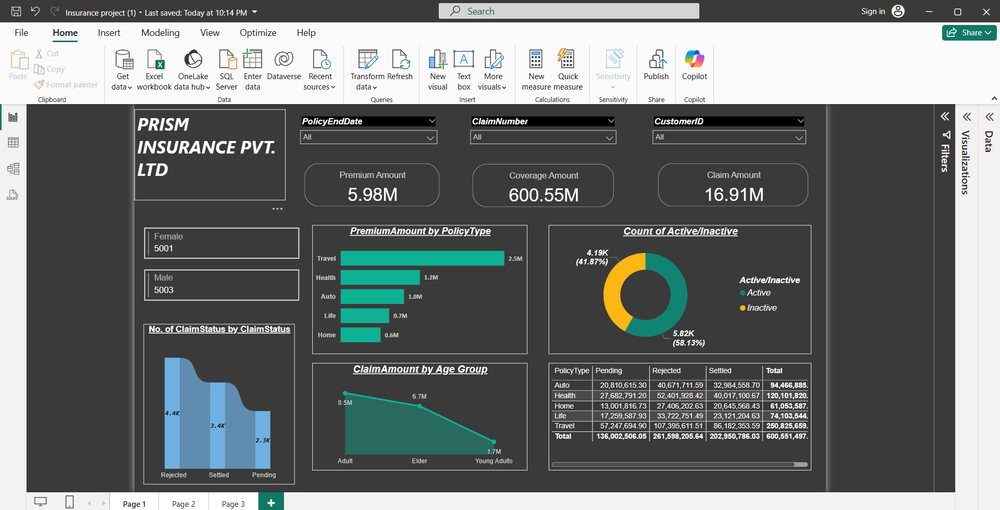

# 📂 Insurance Claims Analysis Dashboard

This Power BI project provides insights into **insurance claim data** to help stakeholders understand patterns in claims, policy types, customer demographics, and fraud risks.

## 📊 Features of the Dashboard
- Overview of **Total Claims**, **Approved & Rejected Claims**
- **Claim Amount Analysis** by Policy Type and Region
- **Customer Age Group Distribution**
- **Fraudulent Claim Detection Indicators**
- **Interactive KPIs** with slicers for dynamic filtering

## 🖼️ Dashboard Preview

## 🛠️ Tools Used
- **Power BI**
- **Data Source:** CSV/Excel Dataset (synthetic or anonymized)

## ✅ Outcome
- Helps insurance companies **identify high-risk policy types**
- Supports **decision-making** regarding claim approvals
- Visualizes **trends in customer demographics and claims**
- Detects potential **fraudulent activity**

## 📎 Files
- `Insurance project.pbix` → Main Power BI report file
- `insurance_dashboard.png` → Dashboard Screenshot

## 📬 Contact
For any queries, feel free to connect:
**📧 anjali89798119@gmail.com**
